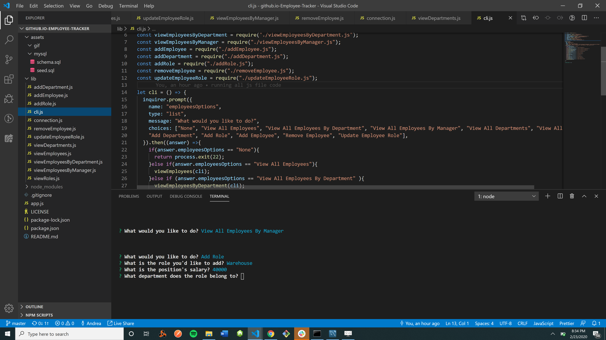

# github.io-Employee-Tracker

## Description

The purpose of this project is to create a command line application that can be used to view and edit employees. 

## User Story

```
As a business owner

I want to be able to view and manage the departments, roles, and employees in my company

So that I can organize and plan my business

```
## Functionality GIF



## How It Works

* User runs 'npm i' for dependencies in the terminal [if error, try npm install inquirer, mysql, console.table, etc.]
* Initiates from the command 'app.js' in the terminal
* User is prompted with questions on what info needs to be viewed and what actions are necessary
* User selects desired actions with arrow keys
* User can edit employees, roles, departments, etc.
* Tables/data exist via MySQL

## Link

 https://github.com/andreathomas19460/github.io-Employee-Tracker
 

## Status 

In progress. Tables/options do not generate in terminal...

## Author

Andrea Thomas
